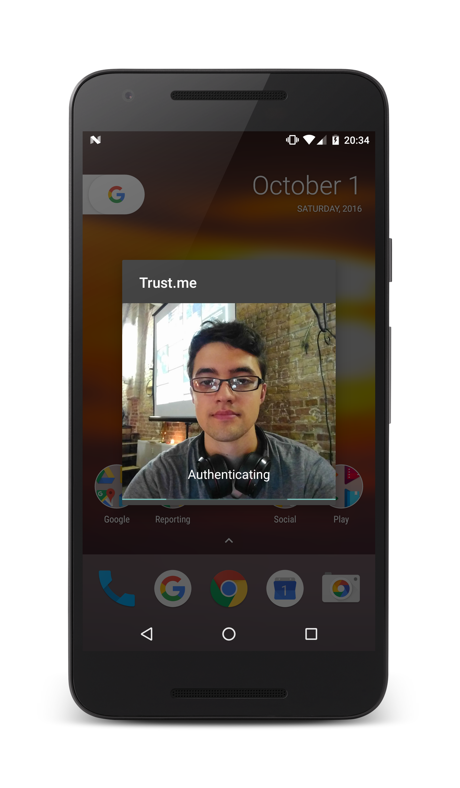

# PostBankBerlin2016

> Authentifizierung auf einem neuen Level. Trust Me haben mit Java und Python und mithilfe der APIs von SAP, SatoshiPay, Postbank Systems und Microsoft das Siegerprojekt des Hackathons gebaut, das euch mithilfe cleverer Features bequem und zuverlässig anhand eures Mobile Device identifiziert.

## Installation

      pip install -r requirements.txt
      export FLASK_APP=app.py
      flask run
